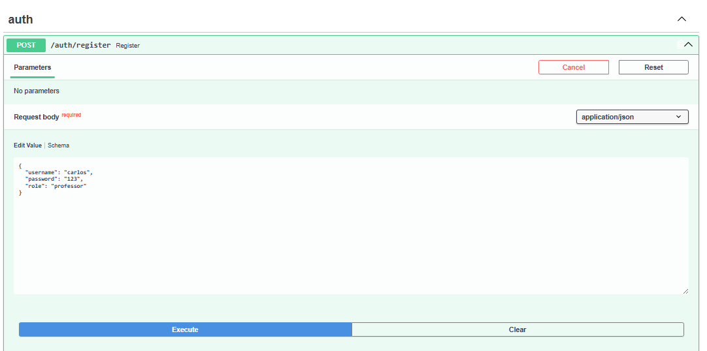
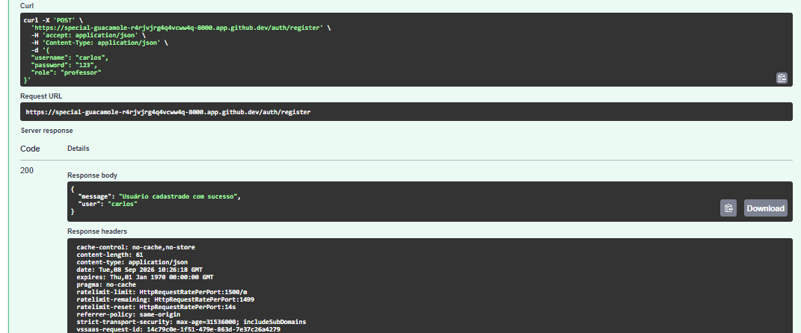
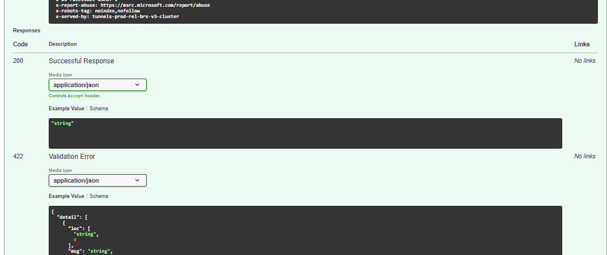
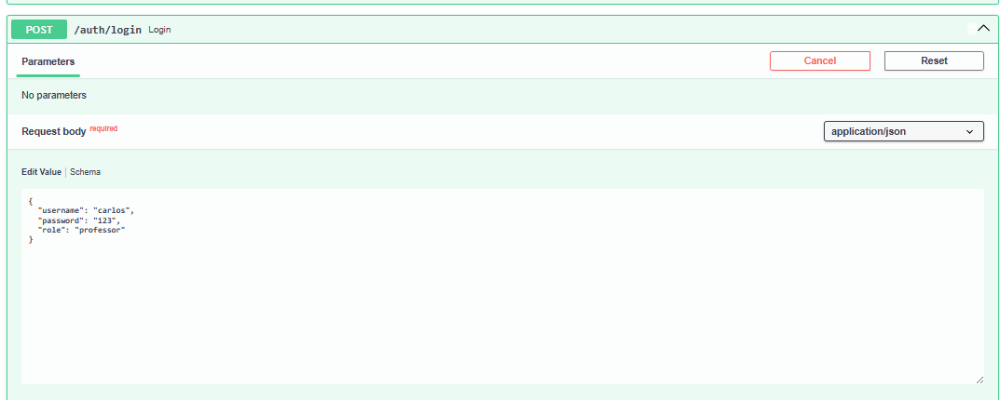
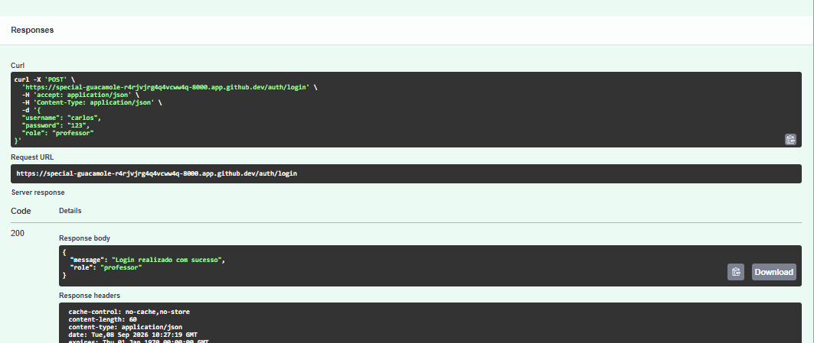
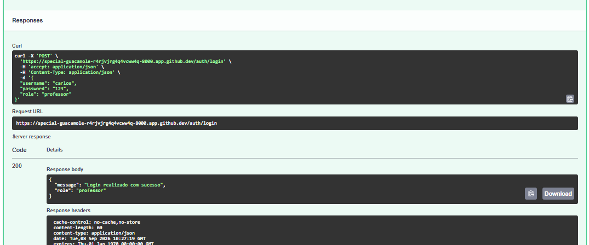

# Guia de Configuração e Fluxo Técnico

## 🚀 Ambiente
1. Criar ambiente virtual:
   ```bash
   python -m venv venv
   source venv/bin/activate   # Linux/Mac
   venv\Scripts\activate      # Windows
   ```
2. Instalar dependências:
   ```bash
   pip install -r requirements.txt
   ```

## 🗄️ Banco de Dados
- Usamos **SQLite** para desenvolvimento local.
- Arquivo: `votacao_escolar.db` (criado automaticamente).
- Configuração em `app/database.py`.

## 🔑 Rotas de Autenticação
- `POST /auth/register` → cadastra usuário.
- `POST /auth/login` → valida credenciais.

## 🧪 Testes
- Subir servidor:
  ```bash
  uvicorn app.main:app --host 0.0.0.0 --port 8000 --reload
  ```
- Swagger UI:
  - Local: `http://127.0.0.1:8000/docs`
  - Codespace: `https://<seu-link>-8000.app.github.dev/docs`

### Fluxo de teste:
1. Cadastro de usuário:
   ```json
   { "username": "carlos", "password": "123", "role": "professor" }





2. Login:
   ```json
   { "username": "carlos", "password": "123", "role": "professor" }




